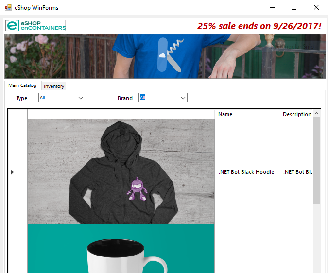

# eShopModernizingWCFWinForms

## Introduction
This sample project shows how to modernize a traditional Line of Business WinForms applications. The WinForms front-end is a fictional inventory app which allows it's users to track inventory for a variety of items being sold through their store. You can look at inventory counts for particular items at different calendar dates. 

The project showcases the following features:
- Containerizing a WCF Service and consuming it from a WinForms App
- Containerizing a SQL database back-end
- Publishing the SQL database to Azure
- Calling a ASP.NET Core Web API from a WinForms App
- Updating a WinForms App to High DPI compatibility
- Deploying a WinForms App via Centennial

## Repository and Project Structure

Because this repo illustrates the modernization of a legacy app, there are two folders containing separate solutions: a legacy version (eShopWinForms) and a modernized version (eShopWinFormsModernized). 
 - **Legacy**: This solution is the raw WinForms (no High DPI support) interfacing with a local WCF service which talks with a local SQL database.
 - **Modernized**: This solution contains all of the features called out above. The front-end becomes High DPI-aware, the WCF service and SQL databases are wrapped into containers, and the WCF service is partially broken out into an ASP.NET Core Web API, callable from our front-end.

Each component of the solution is broken into it's own project (frontend, WCF, etc).

## Prerequisites
System Requirements:
- Windows 10 
- Visual Studio 2017
- .NET Framework 4.7 Installed

## Adding Docker Support

One of the great features that this demo showscases is the ease with which you can deploy your application into containers. To learn about adding docker support, [check out the wiki!](https://github.com/dotnet-architecture/eShopModernizingWCFWinForms/wiki/1.-Adding-Docker-Support)

## Important Quirks and Work-arounds

We are continually developing and refining the docker experience in Visual Studio--and squashing bugs in the process. There are a few notable quirks that you need to be aware of:

### Docker support for WCF

The file that is generated when adding docker support to the WCF service will not compile and run from the get-go. To work around this, you would need to replace the generated dockerfile with the one recommended here: [microsoft/wcf image](https://hub.docker.com/r/microsoft/wcf/). This link walks through what the content of the dockerfile should be and also teaches you how to verify whether the service is running. We've already made the appropriate changes in the modernized version of the application.

Likewise, Visual Studio generates a docker-compose.vs.debug compose file which is incorrectly passing a volume.